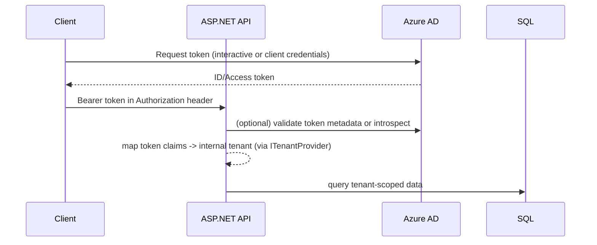
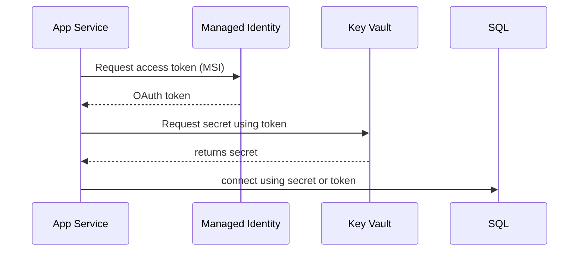

<!-- Prev: messaging.md | Next: README.md -->

# Architecture Diagrams & Flows

This page shows a compact diagram of a common ASP.NET Core application architecture on Azure, and two focused flows: (1) token authentication + tenant mapping and (2) Key Vault access using Managed Identity.

Mermaid: high-level architecture

```mermaid
graph LR
  subgraph Internet
    Client[Client App / Browser]
  end

  Client -->|HTTPS| AppGateway[App Service / Front Door]
  AppGateway --> API[ASP.NET Core API (App Service)]
  API --> SQL[Azure SQL]
  API --> KV[Key Vault]
  API --> SB[Service Bus]
  API --> Blob[Blob Storage]
  SB --> Worker[Background Worker / Functions]
  Worker --> SQL
  Databricks --> Blob
  Databricks --> SQL

  classDef azure fill:#f4faff,stroke:#0366d6
  class AppGateway,API,SQL,KV,SB,Blob,Worker,Databricks azure
```

Image (offline)

If you want an offline PNG image for the above diagram, render the Mermaid source using the included script:

- `diagrams/architecture.mmd` — Mermaid source
- `diagrams/render-diagrams.ps1` — PowerShell script that uses a Dockerized mermaid-cli to produce `diagrams/architecture.png`

Run from PowerShell in this folder:

```powershell
.\diagrams\render-diagrams.ps1
```

When rendered the image will be available at `diagrams/architecture.png` and can be embedded below.

If you prefer I can produce the PNG here and add it to the repo; tell me and I will try to render and commit it.

Flow A: Token validation + tenancy mapping



Flow B: Key Vault with Managed Identity (App Service)



Notes

- Inline diagrams are Mermaid; your renderer may need Mermaid support to display them. If you want image files instead, I can add exported PNGs to this folder.
- Use the other sheets for implementation details and checklist items.

Navigation

- Prev: [Messaging & Events](messaging.md)
- Index: [Overview](README.md)
